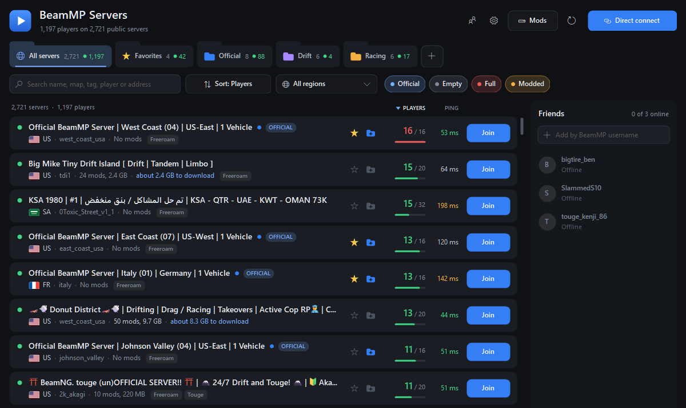
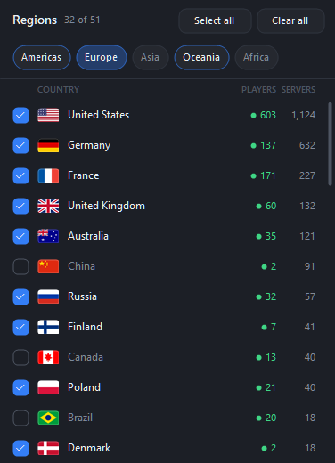
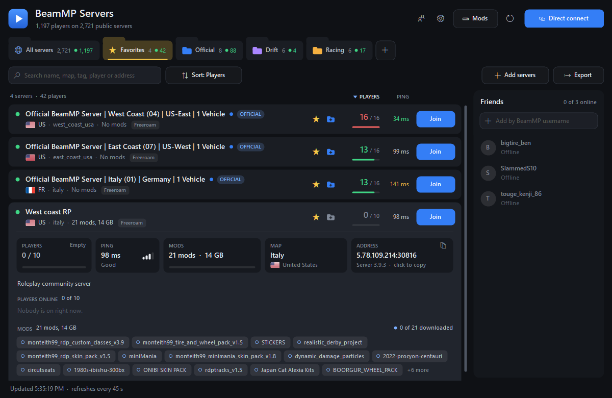
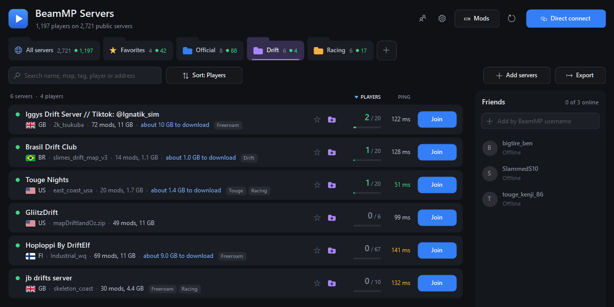
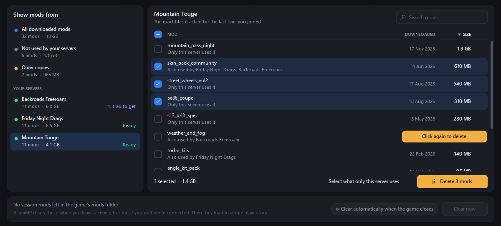
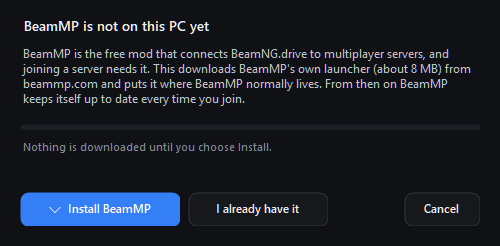

# BeamMP Server Browser

Browse every public [BeamMP](https://beammp.com) server from your desktop, without starting the game, and join the one you want with one click.

One small Windows program. No installer, no account, no background service.



> Unofficial. Not made by, or affiliated with, BeamMP or BeamNG.

## Download

**[Get the latest release](../../releases/latest)**, unzip it anywhere, and run `BeamMP-Server-Browser.exe`.

You need:

- Windows 10 or 11
- BeamNG.drive from Steam, started at least once
- BeamMP, if you already have it. If you do not, the app sets it up the first time you join a server

The program is not code-signed, so Windows may show "Windows protected your PC" the first time you run a downloaded copy. Choose **More info**, then **Run anyway**. If you would rather not, [build it yourself](#building-from-source) with one double-click.

## What it does

### Every server, at a glance

Players, ping, map, country, mods and tags for every public server, refreshed every 45 seconds. A few thousand rows scroll smoothly.

- **Search** by name, map, tag, player or address
- **Sort** by players, ping, name or mod size
- **Filter** by country, and hide official, empty, full or modded servers



### One-click join

Click **Join** and the app starts BeamMP and the game, logs you in, and connects to that server. Progress shows in the app and in the game, including each mod as it downloads.

### Details before you join

Click a server to see who is on, its address, and the mods it needs, with the ones you already have marked.



### Favorites and groups

Star a server, or file servers into coloured groups that sit along the top as folder tabs. Drag the tabs to reorder them.

- Add private servers by `ip:port`, one or many at once
- **Direct connect** checks an address before you join or save it
- Import and export a group as plain text to share it



### Friends

Add BeamMP usernames (guest names work too) and see which server each friend is on. One click joins them.

### A Mods page that answers "what is all this?"

BeamMP keeps every mod it has ever downloaded. This page shows all of them, which of your servers use each one, and what nothing uses any more.

- Pick a server to see just its mods
- Tick mods and delete them together, or one at a time
- See how much joining a server would still download



### Sets up BeamMP for you

No BeamMP yet? The first time you join, the app offers to fetch BeamMP's own launcher. After that BeamMP keeps itself up to date.



## Things to know

| | |
|---|---|
| **Mods come from servers** | Joining from here skips BeamMP's in-game "this server wants to download mods" prompt, so the app asks instead, the first time you join each server. You can turn that off in Settings. |
| **A running game is restarted** | BeamMP cannot be told from outside to switch a running game to another server, so joining closes the game and starts it again. The app asks first. |
| **Guest login** | If BeamMP has no saved account login, the app logs you in as a guest so the join can continue. If you have logged in to BeamMP before, your account is used as normal. |
| **BeamMP is still BeamMP** | This app does not replace BeamMP's launcher or its game mod. It installs BeamMP's own launcher if you need it and starts it for you. That launcher updates itself and the game mod every time it starts. |
| **Deleting mods is for good** | Files are removed from BeamMP's download cache, not sent to the Recycle Bin. A deleted mod downloads again if a server still needs it, so the page says which of your servers use a mod first. |
| **"Downloaded" and "used by"** | Exact for servers you have joined from the app. For others they are worked out from mod names, and worded that way ("about 2.5 GB to download", "probably downloaded"). |
| **Faster mod loading** | An experimental switch in Settings, off by default. It makes the game load a server's mods in one pass instead of several. If a join misbehaves with it on, turn it off. |

Your favorites, groups, friends and settings are kept in `%AppData%\BeamMP Server Browser`, with the previous save beside them as `data.json.bak`. Delete that folder to start over.

If BeamMP is installed somewhere unusual, open Settings and use **Locate** to point at `BeamMP-Launcher.exe`. Settings also shows which BeamMP version you have, and is where you choose the graphics mode the game starts in (game default, Vulkan or DirectX 11).

## Sharing your community's servers

Put a `servers.txt` beside `BeamMP-Server-Browser.exe` and anyone running it for the first time starts with those servers as a group:

```
# group: My Community
Drag strip | 203.0.113.10 | 30814
Street     | 203.0.113.10 | 30815
```

**Export** writes this format, and **Add servers** and **Import** read it, so a group can also be passed around as a text file. A bare `ip:port` per line works too.

## How it works

- **Server list:** `backend.beammp.com/servers-info`, the same list BeamMP's own launcher fetches for the in-game browser.
- **Ping and live player names:** each server is asked directly for its information packet, which BeamMP servers offer for this purpose. Normally only servers on screen, in your folders, or hosting a friend are asked, a few at a time. Sorting the full list by ping asks every server that passes your filters.
- **Joining:** the app runs `BeamMP-Launcher.exe` with a short Lua snippet for the game, which waits for BeamMP to log in and then calls BeamMP's own connect function. Nothing is installed into the game or into BeamMP.
- **Join progress:** read from the BeamMP launcher's log file.
- **Setting up BeamMP:** `BeamMP-Launcher.exe` is downloaded from `backend.beammp.com`, the address BeamMP's launcher uses to update itself (it hands the file over from BeamMP's GitHub releases). The file is only put in place if it matches the hash BeamMP publishes for it. Settings asks the same service for the latest version number.

The program contacts nothing else: no accounts, no analytics, and no update check for the app itself.

## Building from source

The program is plain C# for the .NET Framework that ships with Windows, so no SDK is needed. Double-click `build.bat`, or run:

```bat
build.bat
```

This compiles `src\*.cs` into `BeamMP-Server-Browser.exe` using the C# compiler already on every Windows PC. That compiler only understands C# 5, so the source avoids newer language features.

### Checks

There is no test project; the program can exercise itself:

```bat
BeamMP-Server-Browser.exe --data-dir test --selftest report.txt --screenshot shot.png
BeamMP-Server-Browser.exe --data-dir test --screenshot shot.png --demo
```

`--selftest` clicks through the window on live data and writes down what happened; nothing is saved or launched. `--screenshot` renders the window to a PNG and exits. Always pass `--data-dir` so a test does not read or change your real settings. The other switches are listed at the top of `Program.Main`.

## License

[MIT](LICENSE). Use it, change it, share it.

BeamMP and BeamNG.drive belong to their own makers. This project includes none of their code or files: BeamMP's launcher is downloaded from BeamMP itself, on your PC, only if you ask for it. Country flags are drawn by the program and simplified.
