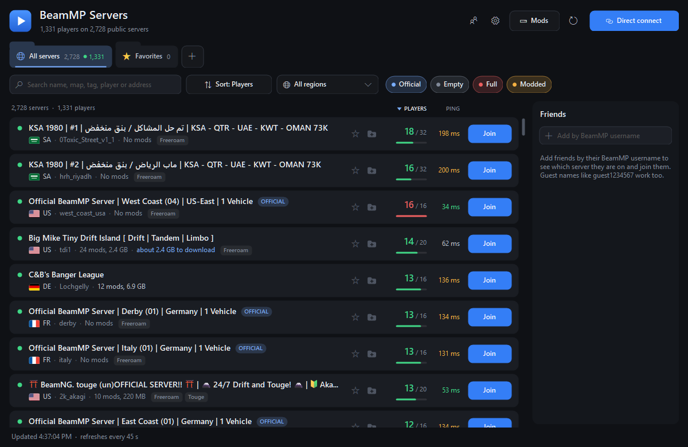

# BeamMP Server Browser

A desktop server browser for [BeamMP](https://beammp.com), the multiplayer mod for BeamNG.drive. Browse every public server without starting the game, then join with one click.

It is one small Windows program with nothing to install. It is unofficial: not made by, or affiliated with, BeamMP or BeamNG.



## What it does

- **Every public server**, refreshed every 45 seconds, with players, ping, map, country, mods and tags. Scrolls smoothly through a few thousand rows.
- **One-click join.** Starts BeamMP's launcher and the game, logs in, and connects to the server you picked. Progress shows in the app and in the game.
- **Favorites and groups.** Star a server, or file servers into coloured groups shown as folder tabs. Drag the tabs to reorder them. Import and export groups as plain text to share them.
- **Private servers.** Add any server by `ip:port` (one or many at once), or use Direct connect to check an address before joining or saving it.
- **Friends.** Add BeamMP usernames (guest names work too) to see which server each friend is on and join them.
- **Filters and sorting.** Search by name, map, tag, player or address; filter by country, official, empty, full or modded; sort by players, ping, name or mod size.
- **Mods at a glance.** Each server shows how many mods it needs, how big they are, and how much of that you already have.
- **A Mods page that answers "what is all this?"** Every mod BeamMP has downloaded, which of your servers use each one, and what nothing uses any more. Pick a server to see just its mods. Tick mods and delete them together, or one at a time.
- **Sets up BeamMP for you.** If BeamMP is not installed, the app offers to fetch BeamMP's own launcher the first time you join. BeamMP then keeps itself up to date.

## Requirements

- Windows 10 or 11
- BeamNG.drive from Steam, started at least once
- BeamMP, if you already have it. If you do not, the app sets it up the first time you join a server

## Running it

Download the zip from the [latest release](../../releases/latest), unzip it anywhere, and run `BeamMP-Server-Browser.exe`. There is no installer.

The program is not code-signed, so the first time you run a downloaded copy Windows may show "Windows protected your PC". Choose **More info**, then **Run anyway**. You can also build it yourself from the source (see below), which takes one double-click.

Your favorites, groups, friends and settings are kept in `%AppData%\BeamMP Server Browser`, with the previous save beside them as `data.json.bak`. Delete that folder to start over.

If BeamMP is installed somewhere unusual, open Settings and use **Locate** to point at `BeamMP-Launcher.exe`. Settings also shows which BeamMP version you have, and is where you choose the graphics mode the game starts in (game default, Vulkan or DirectX 11).

## Sharing your community's servers

Put a `servers.txt` beside `BeamMP-Server-Browser.exe` and anyone running it for the first time starts with those servers as a group:

```
# group: My Community
Drag strip | 203.0.113.10 | 30814
Street     | 203.0.113.10 | 30815
```

The same format is what **Export** writes and **Add servers** and **Import** read, so a group can also be passed around as a text file. A bare `ip:port` per line works too.

## Things to know

- **Mods.** Joining from here skips BeamMP's in-game "this server wants to download mods" prompt, so the app asks instead: the first time you join any server, it tells you what the server says about its mods and asks before going on. You can turn that off in Settings.
- **A running game is restarted.** BeamMP has no way to tell a running game to join a server from outside, so joining closes the game and starts it again. The app asks first.
- **Guest login.** If BeamMP has no saved account login, the app logs you in as a guest so the join can continue. If you have logged in to BeamMP before, your account is used as normal.
- **"Downloaded" is exact only for servers you have joined from the app.** For others it is an estimate from mod names, and is worded that way ("about 2.5 GB to download", "probably downloaded").
- **Faster mod loading** in Settings is experimental and off by default. It makes the game load a server's mods in one pass instead of several. If a join misbehaves with it on, turn it off.
- **BeamMP is still BeamMP.** This app does not replace BeamMP's launcher or its game mod; it installs BeamMP's own launcher if you need it, and starts it for you. That launcher checks for a newer version of itself and of the game mod every time it starts, so updates need nothing from you or from this app.
- **Deleting on the Mods page is for good.** Files are removed from BeamMP's download cache, not sent to the Recycle Bin. A deleted mod downloads again if a server still needs it, so the page says which of your servers use a mod before you delete it. Deleting one mod takes a second click; deleting several asks first.
- **"Used by" is exact only for servers you have joined from the app.** For other saved servers it is matched by mod name.
- Country flags are drawn by the program and simplified.

## How it works

- The server list comes from `backend.beammp.com/servers-info`, the same list BeamMP's own launcher fetches for the in-game browser.
- Ping and live player names come from asking a server directly for its information packet, which BeamMP servers offer for this purpose. Normally only servers on screen, in your folders, or hosting a friend are asked, a few at a time. Sorting the full list by ping asks every server that passes your filters.
- Joining runs `BeamMP-Launcher.exe` with a short Lua snippet for the game that waits for BeamMP to log in and then calls BeamMP's own connect function. Nothing is installed into the game or into BeamMP.
- Join progress is read from the BeamMP launcher's log file.
- Setting up BeamMP downloads `BeamMP-Launcher.exe` from `backend.beammp.com`, the address BeamMP's launcher uses to update itself (it hands the file over from BeamMP's GitHub releases). The file is only put in place if it matches the hash BeamMP publishes for it. Settings asks the same service for the latest version number.

The program contacts nothing else: no accounts, no analytics, and no update check for the app itself.

## Building from source

The program is plain C# for the .NET Framework that ships with Windows, so no SDK is needed. Double-click `build.bat`, or run:

```bat
build.bat
```

This compiles `src\*.cs` into `BeamMP-Server-Browser.exe` using the C# compiler already on every Windows PC. That compiler only understands C# 5, so the source avoids newer language features.

## Developer checks

There is no test project; the program can exercise itself:

```bat
BeamMP-Server-Browser.exe --data-dir test --selftest report.txt --screenshot shot.png
BeamMP-Server-Browser.exe --data-dir test --screenshot shot.png --demo
```

`--selftest` clicks through the window on live data and writes down what happened; nothing is saved or launched. `--screenshot` renders the window to a PNG and exits. Always pass `--data-dir` so a test does not read or change your real settings. The other switches are listed at the top of `Program.Main`.

## License

[MIT](LICENSE). Use it, change it, share it.

BeamMP and BeamNG.drive belong to their own makers. This project includes none of their code or files: BeamMP's launcher is downloaded from BeamMP itself, on your PC, only if you ask for it.
